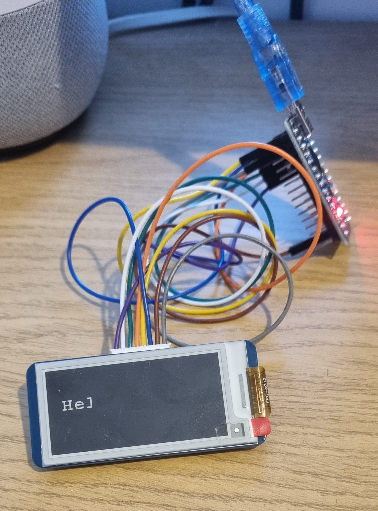

**The Issue:**

The text "Hello World" Is not fully showing.

**Wiring Diagram:**

E-Ink Display pHAT - 2.13" (250x122)** To Arduino Nano

+ DIN: D11
+ CLK: D13
+ CS: D10
+ DC: D9
+ RST: D8
+ BUSY: D7

